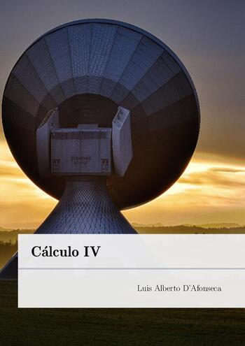

# Cálculo IV

[{ width="350" }](action/Calculo-4.pdf)

Rascunho de um apostila para a antiga disciplina de Cálculo IV do CEFET-MG.

## Sumário

- Apresentação
- Sequências Numéricas
- Séries Numéricas
- Séries de Taylor
- Séries de Fourier
- Equações Diferenciais Parciais
- Transformada de Fourier
- Conteúdo Complementar
- Referências e Recursos Online
- Respostas
- Bibliografia
- Índice Remissivo

## Download

- __[Apostila](action/Calculo-4.pdf)__
