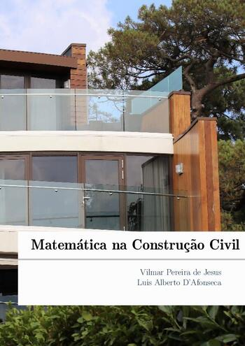

# Matemática na Construção Civil

[{ width="350" }](action/Matematica_Construcao_Civil_Vilmar_Jesus.pdf)

Matemática na Construção Civil é uma apostila abordando a aplicação de alguns
conteúdos de Matemática do Ensino Básico, como perímetro, área e volume, no
cálculo da quantidade de materiais necessários para a construção de uma casa. O
software [Sweet Home 3D](https://www.sweethome3d.com/pt/)
é utilizado para a elaboração e visualização do projeto.

Ela é produto da dissertação de __Vilmar Pereira de Jesus__ defendida no Profmat do
Cefet-MG em maio de 2022 com o título "__Apostila sobre a Matemática na
construção civil com o uso do Sweet Home 3D__".

A importância deste trabalho foi reconhecida pela revista
[Túnel](https://www.secom.cefetmg.br/tunel),
editada pela Secretaria de Comunicação Social do CEFET-MG, que publicou o artigo
[Paredes, piso, teto e muita Matemática: um ensino aplicado](https://www.secom.cefetmg.br/wp-content/uploads/sites/86/2023/07/tunel-3.pdf)
e pela página Diário do Aço que publicou o artigo
[Apostila produzida no Cefet-MG auxilia professores de Matemática relacionando a disciplina com a construção civil](https://www.diariodoaco.com.br/noticia/0111524-apostila-produzida-no-cefetmg-auxilia-professores-de-matematica-relacionando-a-disciplina-com-a-construcao-civil).

## Sumário

- Apresentação
- Construções
- Usando o Sweet Home 3D
- Quantidade de ferragens
- Quantidade de tijolos
- Quantidade de cerâmicas
- Quantidade de concreto
- Instalando e configurando o Sweet Home 3D
- Valores de alguns serviços da construção civil
- Respostas
- Bibliografia

## Download

- __[Apostila](action/Matematica_Construcao_Civil_Vilmar_Jesus.pdf)__
- __[Dissertação](https://sca.profmat-sbm.org.br/busca_tcc_det.php?id=171054682)__
- __[Arquivo BIB](civil.bib)__

