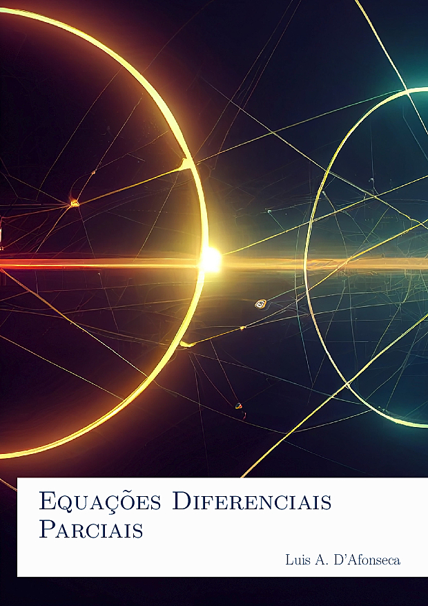

# Equações Diferenciais Parciais

[{ width="350" }](action/Equacoes_Diferenciais_Parciais.pdf)

Apostila, ainda em desenvolvimento, para a disciplina de Equações Diferenciais Parciais do CEFET-MG.

## Sumário

- Séries de Fourier
- Equações Diferenciais Parciais
- Equação do Calor
- Equação da Onda
- Equação de Laplace
- Transformada de Fourier
- Conteúdo Complementar
- Referências e Recursos Online
- Respostas
- Bibliografia
- Índice Remissivo

## Download

- __[Apostila](action/Equacoes_Diferenciais_Parciais.pdf)__
