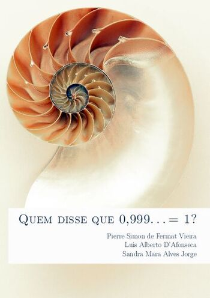

# Quem disse que 0,999... = 1?

[{ width="350" }](action/Infinito-Pierre_Simon_de_Fermat_Vieira.pdf)

Esta é uma apostila para trabalhar o conceito matemático do infinito com alunos
no ensino médio. Seu texto foi elaborado para conduzir uma leitura leve e
descontraia ao mesmo tempo que apresenta os resultados rigorosos necessários
para uma compreensão verdadeira da definição matemática do infinito.

Ela é produto da dissertação de __Pierre Simon de Fermat Vieira__, defendida no
Profmat do Cefet-MG em agosto de 2022 com o título "__Elaboração de uma apostila
para apresentar o infinito no ensino médio__".

## Sumário

- Prefácio
- O Infinito
- Números para Contar
- Números para Medir
- Calculado o Infinito
- Considerações Finais
- Referências
- Índice Remissivo

## Download

- __[Apostila](action/Infinito-Pierre_Simon_de_Fermat_Vieira.pdf)__
- __[Dissertação](https://sca.profmat-sbm.org.br/busca_tcc_det.php?id=171056290)__
- __[Arquivo BIB](infinito.bib)__

