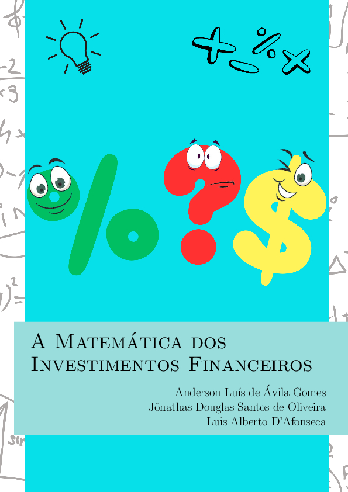

# A Matemática dos Investimentos Financeiros

[{ width="350" }](action/Investimentos_Financeiros_Anderson_Luis_de_Avila_Gomes.pdf)

A apostila __A Matemática dos Investimentos Financeiros__ tem como objetivo
apresentar os conceitos de Matemática Financeira de maneira simples e acessível
para alunos do Ensino Médio. Para tornar o conteúdo mais envolvente e próximo
da realidade dos estudantes, três personagens foram criados, que, ao longo do
material, apresentam problemas cotidianos e suas respectivas soluções.

Inicialmente, a apostila revisa os resultados matemáticos relevantes,
garantindo que os alunos estejam preparados para os tópicos abordados. Em
seguida, são discutidos temas como planejamento financeiro, conceitos
fundamentais da Matemática Financeira (incluindo juros simples e compostos), e
diversas formas de investimento, tudo com exemplos práticos que facilitam a
aplicação do conhecimento na vida real.

Ela é produto da dissertação de __Anderson Luís de Ávila Gomes__, defendida no
Profmat do Cefet-MG em setembro de 2024 com o título "__Explorando as Fórmulas no
Mercado Financeiro: Uma Abordagem Matemática nos Investimentos para Sala de
Aula__".

## Sumário

- Introdução
- Primeiro Nível: Planejamento Financeiro
- Avançando para o Próximo Nível: Compreensão Financeira
- Último Nível: Investimentos Financeiros
- Respostas
- Referências
- Índice remissivo

## Download

- __[Apostila](action/Investimentos_Financeiros_Anderson_Luis_de_Avila_Gomes.pdf)__
- __[Dissertação](https://sca.profmat-sbm.org.br/busca_tcc_det.php?id=171058223)__
- __[Arquivo BIB](investimentos.bib)__

