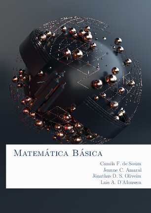

# Matemática Básica

[{ width="350" }](https://material-didatico.github.io/Matematica_Basica/MatematicaBasica.pdf)

Apostila, ainda em desenvolvimento, para a disciplina de Matemática Básica do CEFET-MG.

## Sumário

- Prefácio
- Pensamento Matemático
- Funções
- Funções Polinomiais
- Funções Definidas Por Partes e Função Modular
- Funções Exponenciais
- Funções Inversas e Funções Logarítmicas
- Trigonometria e Funções Trigonométricas

## Download

- __[Apostila](https://material-didatico.github.io/Matematica_Basica/MatematicaBasica.pdf)__
- __[Arquivo BIB](mat_basica.bib)__
