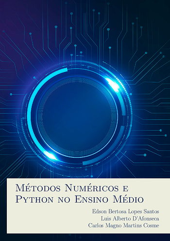

# Matemática na Construção Civil

[{ width="350" }](action/Metodos_Numericos_e_Python_no_Ensino_Medio.pdf)

Esta apostila busca motivar o ensino de Matemática apresentando alguns métodos
numéricos de forma adaptada para o Ensino Médio.

Ela é produto da dissertação de __Edson Bertosa Lopes Santos__, defendida no
Profmat do Cefet-MG em  2024 com o título "__Elaboração de uma apostila sobre
programação e métodos numéricos para o ensino médio__".

## Sumário

- Prefácio
- Apresentação
- Programação
- Funções
- Métodos Numéricos para Zeros de Funções
- Métodos Numéricos para Sistemas de Equações
- Considerações Finais
- Referências
- Índice Remissivo

## Download

- __[Apostila](action/Metodos_Numericos_e_Python_no_Ensino_Medio.pdf)__
- __[Dissertação](https://sca.profmat-sbm.org.br/busca_tcc_det.php?id=171058226)__
- __[Arquivo BIB](met_num_medio.bib)__

