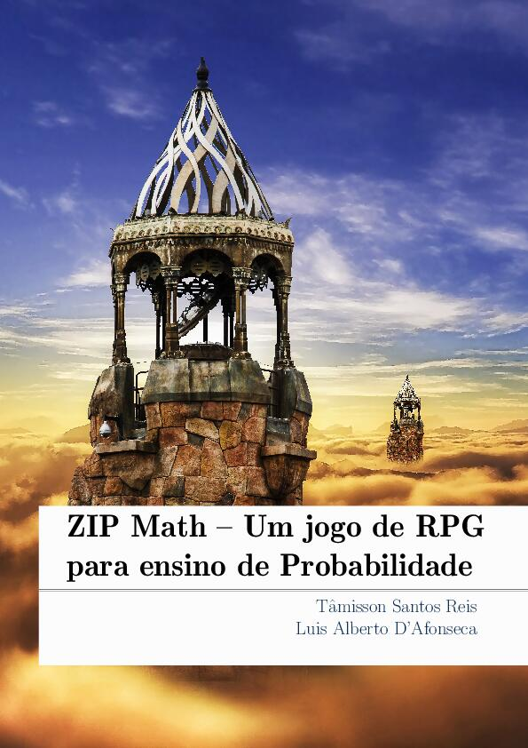

# Matemática para a Administração

[{ width="350" }](action/ZipMath_Tamisson_Reis.pdf)

Zip Math é uma apostila criada para explorar os conteúdos de Combinatória e
Probabilidade no Ensino Fundamental, usando um jogo de RPG como motivador para
o interesse do aluno.

Ela é produto da dissertação de Tâmisson Santos Reis defendida no Profmat do
Cefet-MG em maio de 2022 com o título "Criação de um sistema de RPG como
ferramenta para o ensino de probabilidade".

## Download

- __[Apostila](action/ZipMath_Tamisson_Reis.pdf)__
- __[Arquivo BIB](zip_math.bib)__
